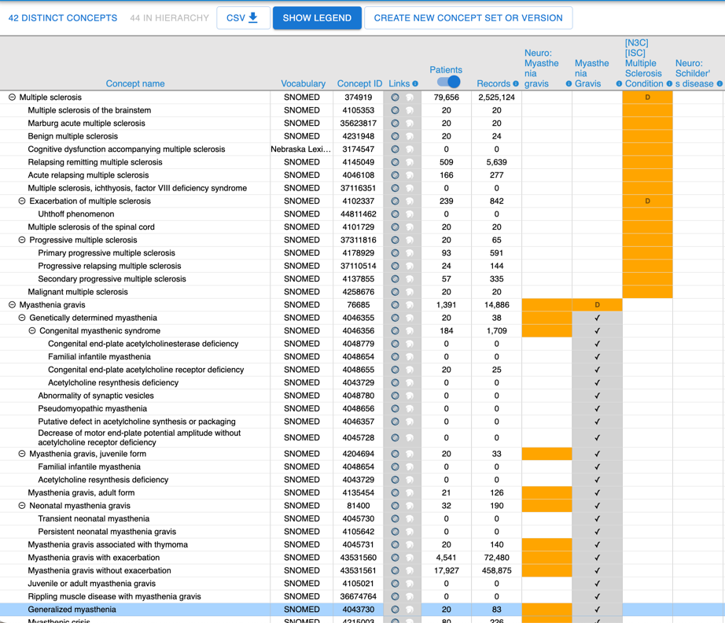

## Commits of interest

### _[eb27fa7](https://github.com/jhu-bids/TermHub/commit/eb27fa7)_ 2023-05-16
First appearance of graph.py. There's important stuff to look at
before this, but can't get older ones working.

Uses cr-hierarchy, which calls connected_subgraph_from_nodes. Method
is to use undirected graph to connect pairs of root nodes
and construct tree on front end.

### ~~_[7c6b78b](https://github.com/jhu-bids/TermHub/commit/7c6b78b)_ 2023-06-26~~
~~Working on caching. Maybe no substantive change since 05-16, but graph.py is
stable. Apparently no change in algorithm until 11-13.~~
Should be same algorithm as above, but can't get this one working. Too many package
issues.

### _[9f6f82b](https://github.com/jhu-bids/TermHub/commit/9f6f82b)_ 2023-11-13
  - From commit message:
      - Totally redid subgraph generation and now downloading indented concept
        list instead of constructing it on the front end based on creating a
        front-end graph based on subgraph edges from backend. Seems to work,
        but collapse is broken now...maybe other stuff too.
      - No longer need an undirected version of the graph
      - Expanded to include all 'Is a' relationships from `concept_relationship`
        table in addition to `concept_ancestor` where min separation = 1 already
        included. [switched back at some later time]
  - In order to get this to work, I had to turn off api_logging (which I've now
    added to the patch file.)
Tested with:
  - [MALIGNANT CANCER](#malignant-cancer)

### _[89863ba9](https://github.com/jhu-bids/TermHub/commit/89863ba9)_ 2023-12-04
  - I don't know why this one seemed important, but it did.

### _[194b52c9](https://github.com/jhu-bids/TermHub/commit/194b52c9)_ 2023-12-18
  - made simplified version of `connect_nodes`. definitely different output
    on some csets (not all). neither is correct though. i wonder if an
    earlier commit has better results
  - added all the tests to the `graph_tst` csv

### _[708ee558](https://github.com/jhu-bids/TermHub/commit/708ee558)_ 2023-12-15
  - On 2024-01-11, this is the commit deployed on dev

### _[7adafa3c](https://github.com/jhu-bids/TermHub/commit/7adafa3c)_ 2023-12-15
  - There was a problem with indented trees sometimes coming out huge
    even when the graphs were smallish. Fixed it. Stephanie had been
    having a problem with browser crashing or hanging a long time with
    https://icy-ground-0416a040f.2.azurestaticapps.net/cset-comparison?codeset_ids=1000057038&codeset_ids=477016825&codeset_ids=633531393
    which should be fine now

### _[04d5699d](https://github.com/jhu-bids/TermHub/commit/04d5699d)_ 2023-12-14
On 2024-01-11, this is the commit deployed on prod
  - The Example comparison on the
    home page was taking forever to run. I figured out
    that I was doing part of the finding common ancestors
    algorithm backwards and now it's very fast.

### _[29ce57d](https://github.com/jhu-bids/TermHub/commit/29ce57d)_ 2024-01-08
  - Base case for `tst_graph`
  - On 2024-01-11 (commit 51bf3851), there have been no graph algorithm changes

## Test cases

[MALIGNANT CANCER](http://localhost:3000/cset-comparison?codeset_ids=585389357&codeset_ids=1000003793)
  - 585389357 v2.0, vocab v5.0 09-APR-22; 1469846 pts, **53510** concepts, flags: D: 1, DX: 5
  - 1000003793 v1.0, vocab v5.0 31-AUG-23; 0 pts, 53993 concepts, flags: D: 1, DX: 5
  - 53K concepts
  - [9f6f82bf](#9f6f82bf): hoses server
  - [eb27fa7](#eb27fa7): takes long time on server (minutes) and crashes browser

[Many small -- neurological](http://localhost:3000/cset-comparison?codeset_ids=1000002657&codeset_ids=241882304&codeset_ids=488007883&codeset_ids=1000087163)
  - [eb27fa7](#eb27fa7)
    - Multiple sclerosis (374919) appears twice; identical except Myasthenia gravis (76685)
      is (sort of) indented below the second one.
      
  - [9f6f82b](#9f6f82b)
    - 